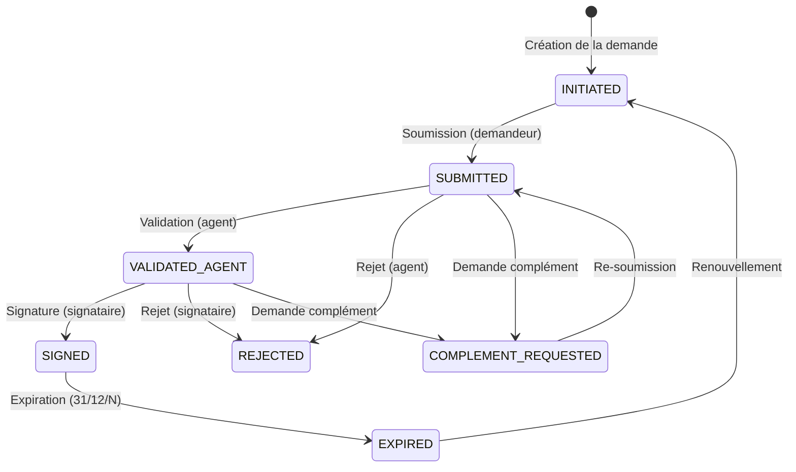

# 📋 Application Service — Module FIMEX

> Service de gestion des demandes FIMEX (Fiches d'Importation/Exportation) pour la plateforme GUCE.

---

## 📑 Table des matières

- [Présentation](#présentation)
- [Architecture](#architecture)
- [Stack technique](#stack-technique)
- [Structure du projet](#structure-du-projet)
- [Modèle de données](#modèle-de-données)
- [Workflow FIMEX](#workflow-fimex)
- [API REST](#api-rest)
- [Configuration](#configuration)
- [Démarrage rapide](#démarrage-rapide)
- [Docker](#docker)
- [Swagger UI](#swagger-ui)
- [Logging & Traçabilité](#logging--traçabilité)

---

## Présentation

Ce microservice gère le cycle de vie complet des demandes FIMEX :
- **Création** de demandes d'importation/exportation
- **Soumission** et traitement par les agents
- **Validation** à deux niveaux (agent + signataire)
- **Rejet** et **demande de complément** d'information
- **Génération d'attestations** PDF
- **Renouvellement** des demandes expirés
- **Gestion des pièces jointes** (upload/download/suppression)

---

## Architecture

Le projet suit une **architecture hexagonale** (Ports & Adapters) stricte :

```
┌─────────────────────────────────────────────────────────┐
│                    adapter.in.web                        │
│  Controllers REST (FimexDocument, Workflow, Attachment)  │
└──────────────────────┬──────────────────────────────────┘
                       │ use case ports (in)
┌──────────────────────▼──────────────────────────────────┐
│                      domain                              │
│  Models (records) │ Services │ Ports (in/out) │ Enums   │
└──────────────────────┬──────────────────────────────────┘
                       │ repository ports (out)
┌──────────────────────▼──────────────────────────────────┐
│                  infrastructure                          │
│  JPA Entities │ Repositories │ Config │ Kafka            │
└─────────────────────────────────────────────────────────┘
```

### Principes

| Principe | Implémentation |
|----------|---------------|
| **Domain Models** | Java Records purs (immutables) |
| **JPA Entities** | Classes Lombok (`@Data`, `@NoArgsConstructor`, `@AllArgsConstructor`) |
| **Ports In** | Interfaces use case (`ProcessFimexDocumentUseCase`, etc.) |
| **Ports Out** | Interfaces repository (`FimexDocumentRepositoryOutPort`, etc.) |
| **Mappers** | Méthodes statiques `fromDomain()` / `toDomain()` dans les entités |
| **Annotations** | `@DomainService` pour les services domaine |

---

## Stack technique

| Composant | Technologie | Version |
|-----------|-------------|---------|
| **Langage** | Java | 25 |
| **Framework** | Spring Boot | 3.x |
| **Build** | Maven | - |
| **Base de données** | PostgreSQL | 16 |
| **ORM** | Spring Data JPA / Hibernate | - |
| **Migrations** | Liquibase | YAML |
| **Messaging** | Apache Kafka + Schema Registry | Confluent 7.7 |
| **API Docs** | SpringDoc OpenAPI (Swagger UI) | 2.8.6 |
| **PDF** | Thymeleaf + Flying Saucer (ou iText) | - |
| **Logging** | SLF4J + Logback + MDC | - |
| **Boilerplate** | Lombok | - |

---

## Structure du projet

```
src/main/java/com/guce/application/
├── ApplicationServiceApplication.java              # Point d'entrée Spring Boot
│
├── adapter/
│   ├── in/web/                          # Controllers REST
│   │   ├── FimexDocumentController.java    # CRUD demandes
│   │   ├── FimexWorkflowController.java    # Actions workflow
│   │   ├── FimexAttachmentController.java  # Pièces jointes
│   │   └── dto/                            # DTOs (request/response)
│   │       ├── CreateFimexDocumentRequestDTO.java
│   │       ├── CreateFimexDocumentResponseDTO.java
│   │       ├── FimexDocumentDetailDTO.java
│   │       ├── FimexDocumentListDTO.java
│   │       ├── WorkflowActionRequestDTO.java
│   │       └── StatusHistoryDTO.java
│   └── out/persistence/                 # Adapters JPA (ports out)
│       ├── FimexDocumentQueryAdapter.java
│       ├── FimexDocumentRepositoryAdapter.java
│       ├── AttachmentStorageAdapter.java
│       ├── StatusHistoryAdapter.java
│       └── FimexReferenceNumberAdapter.java
│
├── application/service/                 # Application services
│   └── FimexDocumentApplicationService.java
│
├── domain/
│   ├── annotation/
│   │   └── DomainService.java           # Annotation custom
│   ├── model/                           # Domain models (Java records)
│   │   ├── DocumentStatus.java             # Enum + State Machine
│   │   ├── FimexDocumentModel.java
│   │   ├── FimexAttachmentModel.java
│   │   ├── FimexProductModel.java
│   │   ├── FimexClientModel.java
│   │   ├── FimexOrganizationModel.java
│   │   ├── RefOfficeModel.java
│   │   ├── RefRequestTypeModel.java
│   │   ├── StatusHistoryModel.java
│   │   ├── SearchCriteria.java
│   │   └── UserProfile.java
│   ├── port/
│   │   ├── in/                          # Use case interfaces
│   │   │   ├── ProcessFimexDocumentUseCase.java
│   │   │   ├── RenewFimexDocumentUseCase.java
│   │   │   ├── GetFimexDocumentUseCase.java
│   │   │   ├── CreateFimexDocumentUseCase.java
│   │   │   ├── ManageAttachmentUseCase.java
│   │   │   └── GenerateAttestationUseCase.java
│   │   └── out/                         # Repository interfaces
│   │       ├── FimexDocumentRepositoryOutPort.java
│   │       ├── FimexDocumentQueryOutPort.java
│   │       ├── AttachmentStorageOutPort.java
│   │       ├── StatusHistoryOutPort.java
│   │       ├── FimexReferenceNumberPort.java
│   │       └── AttestationGeneratorOutPort.java
│   └── service/                         # Domain services
│       ├── FimexDocumentService.java
│       ├── FimexDocumentQueryService.java
│       ├── FimexDocumentWorkflowService.java
│       ├── AttachmentService.java
│       └── AttestationDomainService.java
│
└── infrastructure/
    ├── config/
    │   ├── aop/
    │   │   ├── MDCLogging.java             # Annotation MDC custom
    │   │   └── MDCLoggingAspect.java       # Aspect AOP
    │   └── kafka/
    │       ├── KafkaConfiguration.java
    │       └── KafkaTemplateFactory.java
    ├── persistence/
    │   ├── entities/                    # Entités JPA (Lombok)
    │   │   ├── FimexDocumentEntity.java
    │   │   ├── FimexAttachmentEntity.java
    │   │   ├── FimexProductEntity.java
    │   │   ├── FimexClientEntity.java
    │   │   ├── FimexOrganizationEntity.java
    │   │   ├── RefAgentEntity.java
    │   │   ├── RefOfficeEntity.java
    │   │   ├── RefRequestTypeEntity.java
    │   │   └── StatusHistoryEntity.java
    │   └── repository/                  # Spring Data JPA repos
    │       ├── FimexDocumentJpaRepository.java
    │       ├── FimexAttachmentJpaRepository.java
    │       ├── StatusHistoryJpaRepository.java
    │       ├── FimexSequenceJpaRepository.java
    │       └── RefAgentJpaRepository.java
    └── util/
        └── ...
```

---

## Modèle de données

```
┌──────────────────────────────────────────────────────────┐
│                    fimex_document                         │
├──────────────────────────────────────────────────────────┤
│ id (PK)              │ uuid                              │
│ client_id (FK)       │ uuid → fimex_client               │
│ office_id (FK)       │ uuid → ref_office                 │
│ organization_id (FK) │ uuid → fimex_organization          │
│ request_type_id (FK) │ uuid → ref_request_type            │
│ status               │ varchar                           │
│ is_renewal           │ boolean                           │
│ ref_file_number      │ varchar                           │
│ requested_date       │ timestamptz                       │
│ expiry_date          │ date                              │
│ agent_id (FK)        │ uuid → ref_agent                  │
│ signatory_id (FK)    │ uuid → ref_agent                  │
│ created_at           │ timestamptz                       │
│ updated_at           │ timestamptz                       │
└──────────────────────────────────────────────────────────┘
        │ 1:N                │ 1:N                │ 1:N
        ▼                    ▼                    ▼
┌───────────────┐  ┌──────────────────┐  ┌──────────────────────┐
│ fimex_product │  │ fimex_attachment  │  │ fimex_status_history │
├───────────────┤  ├──────────────────┤  ├──────────────────────┤
│ id (PK)       │  │ id (PK)          │  │ id (PK)              │
│ document_id   │  │ document_id      │  │ document_id          │
│ code_sh       │  │ attachment_type   │  │ from_status          │
└───────────────┘  │ file_name        │  │ to_status            │
                   │ content (bytea)  │  │ changed_by           │
                   │ file_status      │  │ comment              │
                   │ upload_date      │  │ created_at           │
                   └──────────────────┘  └──────────────────────┘
```

### Index de performance

- `idx_fimex_document_status` → recherche par statut
- `idx_fimex_document_client_id` → recherche par client
- `idx_fimex_document_requested_date` → tri par date
- `idx_fimex_document_created_at` → tri par création

---

## Workflow FIMEX

Le workflow utilise une **machine à états enum-based** dans `DocumentStatus` :



Les transitions valides sont définies dans `DocumentStatus.TRANSITIONS` — source unique de vérité.

---

## API REST

Base URL : `http://localhost:8084/application-service`

Toutes les API sont documentées via Swagger UI (voir section dédiée). Ci-dessous les **endpoints principaux** pour l'intégration Frontend.

### 1. Gestion des demandes (CRUD)

| Méthode | Endpoint | Description | Payload (Request) | Response |
|---------|----------|-------------|-------------------|----------|
| `POST` | `/api/v1/fimex/requests` | Créer une demande brouillon. | `{ "clientId": "uuid", "requestTypeId": "uuid", "products": [ {"codeSh": "str"} ] }` | `UUID` (ID de la demande) |
| `GET` | `/api/v1/fimex/requests` | Lister / Rechercher (paginé). | Paramètres d'URL : `page, size, status, clientId...` | `Page<FimexRequestListDTO>` |
| `GET` | `/api/v1/fimex/requests/{id}` | Obtenir le détail complet d'une demande. | - | `FimexRequestDetailDTO` (inclut métadonnées des pièces jointes, sans le binaire) |
| `GET` | `/api/v1/fimex/requests/reference-data`| Obtenir les référentiels (types de demande, etc.) | - | `RefDataDTO` |

### 2. Pièces jointes (Attachments)

**Attention** : Les opérations de modification/suppression ne sont possibles que si la demande est au statut `INITIATED` ou `COMPLEMENT_REQUESTED`.

| Méthode | Endpoint | Description | Payload (Request) | Response |
|---------|----------|-------------|-------------------|----------|
| `POST` | `/api/v1/fimex/requests/{id}/attachments` | Ajouter un fichier (max 10 MB). **multipart/form-data** | `file` (binaire), `type` (ex: "FACTURE") | `UUID` (ID de la pièce jointe) |
| `GET` | `/api/v1/fimex/requests/{id}/attachments/{attachmentId}` | Télécharger une pièce jointe. | - | Corps binaire. Headers: `Content-Type` (auto-détecté par magic bytes) et `Content-Disposition`. |
| `DELETE`| `/api/v1/fimex/requests/{id}/attachments/{attachmentId}` | Supprimer une pièce jointe. | - | `204 No Content` |

### 3. Workflow (Actions métier)

Toutes les actions de workflow sont des `POST` car elles mutent l'état (Statut) de la demande.

| Méthode | Endpoint | Description | Payload (Request) | Response |
|---------|----------|-------------|-------------------|----------|
| `POST` | `/api/v1/fimex/requests/{id}/submit` | L'importateur soumet la demande. Transition : `INITIATED` → `SUBMITTED`. | - | `200 OK` |
| `POST` | `/api/v1/fimex/requests/{id}/validate` | L'agent valide. Transition : `SUBMITTED` → `VALIDATED_AGENT` (ou `SIGNED` pour signataire). | `{ "comment": "Mise aux normes valide" }` `(optionnel)` | `200 OK` |
| `POST` | `/api/v1/fimex/requests/{id}/reject` | L'agent rejette définitivement. Transition : `*` → `REJECTED`. | `{ "comment": "Produit interdit Réf. X" }` `(obligatoire)` | `200 OK` |
| `POST` | `/api/v1/fimex/requests/{id}/request-complement` | Demande d'infos supplémentaires. Transition : `*` → `COMPLEMENT_REQUESTED`. | `{ "comment": "Facture illisible" }` `(obligatoire)` | `200 OK` |
| `POST` | `/api/v1/fimex/requests/{id}/renew` | Renouveler une demande expirée. Clone la demande. | - | `UUID` (ID de la nouvelle demande) |
| `GET` | `/api/v1/fimex/requests/{id}/history` | Récupérer l'historique complet des actions/commentaires. | - | `List<StatusHistoryDTO>` |
| `GET` | `/api/v1/fimex/requests/{id}/attestation`| Télécharger l'attestation PDF finale (si statut `SIGNED` ou `EXPIRED`). | - | Fichier PDF (Binaire) |

---

## Configuration

### Profils Spring

| Profil | Fichier | Usage |
|--------|---------|-------|
| `default` | `application.yaml` | Configuration de base |
| `local` | `application-local.yaml` | Développement Docker local |

### Propriétés principales (`application-local.yaml`)

| Propriété | Valeur |
|-----------|--------|
| Port serveur | `8084` |
| Context path | `/application-service` |
| PostgreSQL | `localhost:5436` / `application` / `application` |
| Kafka | `localhost:9093` |
| Schema Registry | `localhost:8082` |
| Upload max | `10 MB` |
| Swagger UI theme | Dark (custom CSS) |

---

## Démarrage rapide

### Prérequis

- Java 25
- Maven 3.9+
- Docker & Docker Compose

### Lancer l'environnement

**Linux / macOS :**
```bash
chmod +x start.sh
./start.sh
```

**Windows (PowerShell) :**
```powershell
.\start.ps1
```

Ces scripts exécutent :
1. `docker-compose down -v` (arrêt + suppression des volumes)
2. `docker-compose up -d --build` (build + démarrage)

### Lancer sans Docker (développement)

```bash
# Démarrer uniquement les dépendances
docker-compose up -d postgres kafka schema-registry

# Lancer l'application
mvn spring-boot:run -Dspring-boot.run.profiles=local
```

---

## Docker

### Services Docker Compose

| Service | Image | Port externe | Port interne |
|---------|-------|-------------|-------------|
| **PostgreSQL** | `postgres:16-alpine` | `5436` | `5432` |
| **Zookeeper** | `confluentinc/cp-zookeeper:7.7.0` | `2182` | `2181` |
| **Kafka** | `confluentinc/cp-kafka:7.7.0` | `9093` | `9092` |
| **Schema Registry** | `confluentinc/cp-schema-registry:7.7.0` | `8082` | `8081` |
| **Application** | Build local (`Dockerfile`) | `8084` | `8084` |

### Commandes utiles

```bash
# Voir les logs de l'application
docker-compose logs -f application-service

# Accéder à la base PostgreSQL
docker exec -it application-service-db psql -U application -d application_service

# Redémarrer uniquement l'application
docker-compose restart application-service

# Tout supprimer (containers + volumes)
docker-compose down -v
```

---

## Swagger UI

Accessible à : **http://localhost:8084/application-service/swagger-ui/index.html**

- Thème **dark** personnalisé avec logo GUCE
- Documentation complète de tous les endpoints
- Test interactif des API

---

## Logging & Traçabilité

### MDC Logging

Toutes les méthodes des controllers sont annotées avec `@MDCLogging` qui ajoute automatiquement un `correlation_id` (UUID) dans le MDC pour chaque requête.

```
2026-03-08 22:00:00 [correlation_id=a1b2c3d4] INFO  - GET /api/v1/fimex-documents/123
```

### Niveaux de log

| Environnement | `com.guce` | `org.hibernate.SQL` |
|---------------|-----------|---------------------|
| **Docker** | `INFO` | - |
| **Local** | `DEBUG` | `DEBUG` |

---

## Migrations Liquibase

Les migrations sont dans `src/main/resources/db/changelog/` au format YAML.

Convention de nommage : `YYYYMMDD-NNN-description.yaml`

```
db/changelog/
├── db.changelog-master.yaml
└── 0.0.1/
    ├── 20260308-001-create-ref-tables.yaml
    ├── 20260308-002-create-fimex-document.yaml
    ├── 20260308-003-create-fimex-product.yaml
    ├── 20260308-004-create-fimex-attachment.yaml
    ├── 20260308-005-create-fimex-sequence.yaml
    ├── 20260308-006-create-status-history.yaml
    ├── 20260308-007-alter-fimex-document.yaml
    ├── 20260308-008-instant-to-offsetdatetime.yaml
    └── 20260308-009-add-fimex-document-indexes.yaml
```
